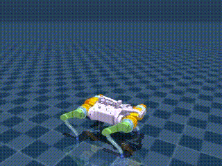

# Training Four-Legged Robots with Reinforcement Learning

## Overview
This project explores the application of advanced reinforcement learning (RL) techniques to train a four-legged robot for improved locomotion. Three distinct training sessions using Proximal Policy Optimization (PPO) and Soft Actor-Critic (SAC) algorithms were conducted to develop robust and adaptive movement strategies. The training focused on optimizing reward functions for various performance metrics such as velocity, orientation, and stability. Stable policies were derived from these sessions and evaluated to demonstrate significant improvements in the robot’s navigational capabilities.

  
     
  <i>Figure 1. Barkour</i>

## Training Files
Three Colab files have been provided for training a four-legged robot using different RL algorithms:

1. **Partial Terrain in PPO Training**
    - `train_ppo.ipynb`: This Colab file includes training with partial terrain and resets using a plain ground plane.
2. **Using Stable Policies for Evaluation**
    - For all three training sessions, we've stored stable policies that achieved good performance. You can use these policies to evaluate the trained models:
        - `barkour_terrain_ppo_policy` for `train_ppo.ipynb`
        - `barkour_v0_sac_policy` for `train_sac_v0.ipynb`
        - `barkour_v0_ppo_policy` for `train_ppo_v0.ipynb`

## Methodology
The methodology employed in this study involved evaluating the efficacy of two reinforcement learning algorithms, Proximal Policy Optimization (PPO) and Soft Actor-Critic (SAC), for training a four-legged robot using the Brax simulation environment.

### Reward Function
To facilitate effective learning, a carefully designed reward function was crafted to encourage the development of a stable gait in the robot:

- **Encouraging Forward Motion**: Rewarding linear velocity in the xy-axis incentivizes progress towards goals.
- **Facilitating Stable Rotation**: Rewarding angular velocity in the z-axis helps maintain stability while turning.
- **Discouraging Jumping/Falling**: Penalizing excessive linear velocity in the z-axis prevents erratic behaviors.
- **Promoting Stability**: Penalizing angular velocity in the xy-plane ensures a stable and balanced gait.
- **Maintaining Balance**: Rewarding torque maintenance helps the robot execute controlled movements.
- **Upholding Upright Orientation**: Penalizing non-zero roll and pitch angles keeps the robot in an upright position.

## Simulation Environment
This study leverages the **Brax** physics engine and **MuJoCo**, both known for their accuracy and scalability in robotics simulations. The Barkour V0 model was sourced from MuJoCo and integrated into Brax for training.

## References
The following resources were instrumental in our research:
- Brax repository by Google: [https://github.com/google/brax](https://github.com/google/brax)
- Bittle repository by Sentdex: [https://github.com/Sentdex/TD3-Bittle](https://github.com/Sentdex/TD3-Bittle)

These repositories provided a foundation for implementing and training advanced robotic models efficiently.
